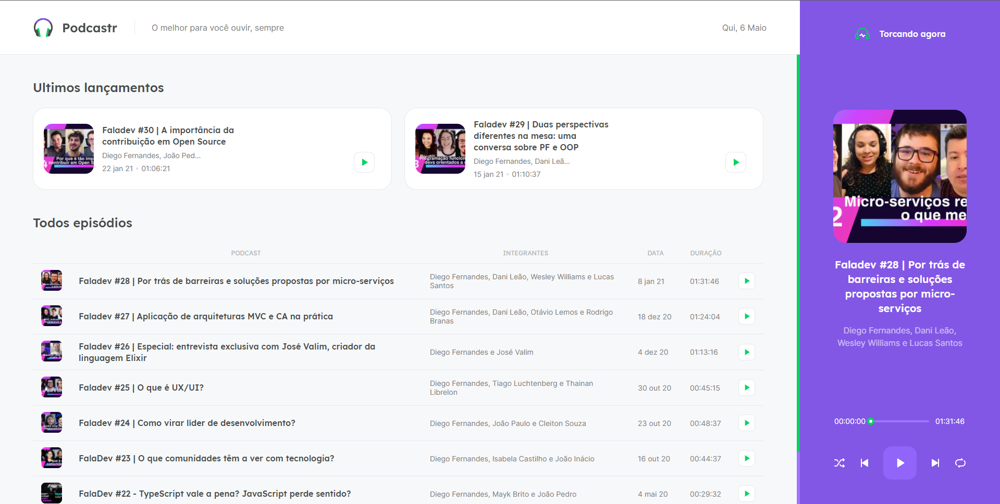

# 🎤 Podcastr

 

## 💡 Sobre

Este projeto foi desenvolvido durante a NextLevelWeek#5 da Rocketseat, ministrada pelo Diego Fernandes, com o propósito de construir uma aplicação que seja capaz de reproduzir podcasts.

Durante a semana foi abordado temas como o uso de useRefs no React, Context API, tag áudio do HTML5, geração de rotas estáticas e dinâmicas com Next.js, SASS, etc.

 

🔛 **Teste online agora: [podcastr](https://podcastr-lmiguelm.vercel.app).**

 

## 🚀 Tecnologias:

Esse projeto foi desenvolvido com as seguintes tecnologias:

- [Next.js](https://reactjs.org)
- [TypeScript](https://www.typescriptlang.org/)
- [JSON-Server](https://github.com/typicode/json-server)

 

## 💻 Como usar

- **_Clone o projeto:_**  
  ` git clone https://github.com/lmiguelm/podcastr.git`

- **_Entre na pasta do projeto:_**  
  `cd podcastr`

- **_Baixe as dependências:_**  
  ` yarn || npm install`

- **_Rodar o site:_**  
  `yarn start || npm start`

- **_Rodar o json-server:_**  
  `yarn server || npm server`
